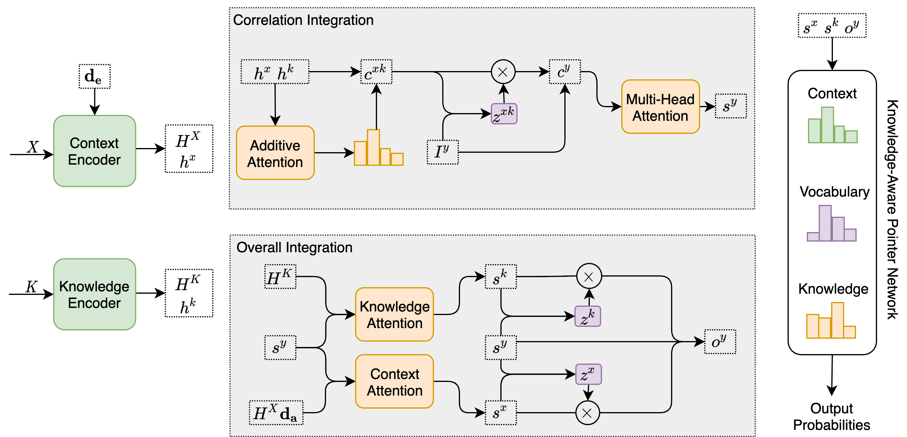

# TransIKG (TASLP 2022 **Regular Paper**)

The code for [Exploiting Pairwise Mutual Information for Knowledge-Grounded Dialogue](https://ieeexplore.ieee.org/document/9739959). 



## Reference

If you use any source code included in this repo in your work, please cite the following paper.

```
@article{zhang2022exploiting,
  title={Exploiting Pairwise Mutual Information for Knowledge-Grounded Dialogue},
  author={Zhang, Bo and Wang, Jian and Lin, Hongfei and Ma, Hui and Xu, Bo},
  journal={IEEE/ACM Transactions on Audio, Speech, and Language Processing},
  volume={30},
  pages={2231--2240},
  year={2022},
  doi={10.1109/TASLP.2022.3161151}
}
```

## Requirements

* Python 3.8
* Pytorch 1.8
* ParlAI 1.2
* CUDA 11
* Tesla V100 32G

## Datasets

We use Wizard of Wikipedia and Holl-E datasets. Note that we used modified verion of Holl-E relased by [Kim et al](https://arxiv.org/abs/2002.07510?context=cs.CL) (But they don't release the validation set). Both datasets have already been processed into our defined format, which could be directly download by our code.

## Running Codes
Move the folder named parlai_internal to [ParlAI](https://github.com/facebookresearch/ParlAI).

Wizard of Wikipedia
```bash
python parlai_internal/agents/trans_ikg/train_model_wow.py
or
python parlai_internal/agents/trans_ikg_bert/train_model_wow.py
```

Holl-E
```bash
python parlai_internal/agents/trans_ikg/train_model_holle.py
or
python parlai_internal/agents/trans_ikg_bert/train_model_holle.py
```


